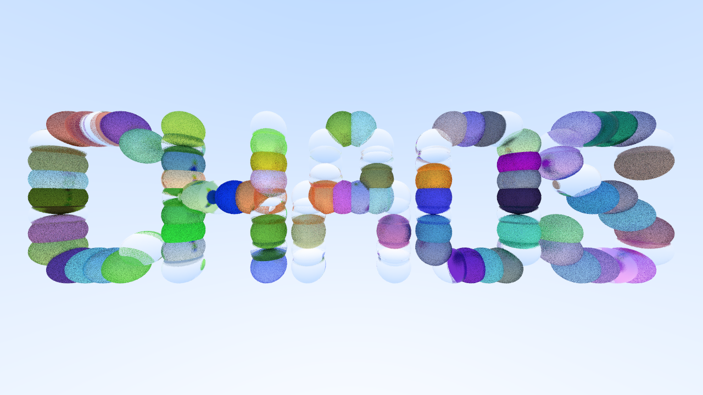

# chaos - A CPU-based Ray Tracer in C++


## Context

This project was made as part of the [Chaos](https://www.chaos.com/) Ray Tracing Camp 2026. The goal of the camp was to progressively build a ray tracing engine. The camp covered topics like the fundamentals of ray tracing, materials, textures... This repo is my attempt at implementing some of these concepts in C++.

## Usage

Each major feature has a dedicated test in the `test` directory, you can run one of these tests as follows:

```bash
mkdir build
cmake -S. -Bbuild
cmake --build build
./build/<test-name>
```

To make sure that a test works correctly, you can reference the expected outputs in the `pics` directory.

By default the generated output images will be low resolution, to change the resolution of the output images you can change the file `test/shared.h` and rebuild the tests. Note that increasing the resolution will significantly increase the runtime of the test for complex scenes.

## Key features

Some of the key features of the engine:
- A simplified ECS-like architecture for state management.
- Support for loading (simple) OBJ files and CRTScene files (A custom json-based 3D scene definition format for the Chaos Ray Tracing Camp) 
- Support for diffuse, reflective and refractive materials, and bitmap textures.
- Support for multiple output image file formats. 
- A bit of OpenMP acceleration in the rendering loop.

## References

In addiction to the course material provided by the camp instructors, some design decisions where taken from [Ray Tracing in One Weekend](https://raytracing.github.io/books/RayTracingInOneWeekend.html).
